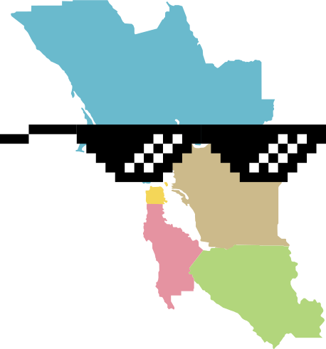

   
  
   
   

- [Day Trips](#day-trips)
- [Events](#events)
- [Food](#food)
- [Hiking](#hiking)
- [Museums and Galleries](#museums-and-galleries)
- [Performing Arts](#performing-arts)
- [Parks & Playgrounds](#parks--playgrounds)
- [Shopping](#shopping)
- [Sights](#sights)
- [Sports](#sports)
- [Wedding Venues](#wedding-venues)

# Day Trips

### East Bay
- Santa Rosa: See exotic animals at [Safari West](https://www.safariwest.com/), then drink some Pliny the Elder beer at [Russian River Brewing Company](https://russianriverbrewing.com/)
- Livermore: Explore the [Livermore Valley Wine Country](https://www.lvwine.org/itinerary-planner.php)

### North Bay
- Guerneville: Float on the Russian River at [Johnson's Beach](https://johnsonsbeach.com/), then ice cream and pie at [Guerneville Bank Club](http://www.guernevillebankclub.com/)
- Petaluma: Brewery tour at [Lagunitas Brewing Company](https://lagunitas.com/)
- Sonoma County: Horseback trail riding in [Bodega Dunes Beach](https://www.sonomacounty.com/outdoor-activities/horse-n-around-trail-rides), then fresh oysters at [Hog Island Oyster Company](https://hogislandoysters.com/) (Marshall, CA) 
- Point Arena (south of Mendecino): Tour of [Point Arena Light House](https://www.pointarenalighthouse.com/) (the tallest lighthouse on the Pacific Coast), then lunch at [Queenie's Roadhouse Cafe](http://queeniesroadhousecafe.com/)

### Peninsula
- Half Moon Bay: [Whale watching](https://www.oceanicsociety.org/whale-watching)
- Pescadero: Breakfast at [Alice's](http://www.alicesrestaurant.com/), then [Harley Farms Goat Dairy](http://harleyfarms.com/), then [Duarte's Tavern](http://www.duartestavern.com/) for artichoke soup and olallieberry pie.
- Pescadero: [Pigeon Point Light Station](https://www.parks.ca.gov/?page_id=533), then Elephant seals at [Año Nuevo State Park](http://www.parks.ca.gov/?page_id=523), then eat pie at [Pie Ranch](https://www.pieranch.org/)
- Santa Cruz: Redwood canpoy tours and aerial adventure course at [Mount Hermon Adventures](https://mounthermonadventures.com/)
- Santa Cruz: Ride the Big Dipper at [Santa Cruz Beach Boardwalk](https://beachboardwalk.com/), then [Marianne's Ice Cream](https://mariannesicecream.com/), then visit [Natural Bridges](http://www.parks.ca.gov/?page_id=541)
- Santa Cruz: Hike through the redwoods in [Henry Cowell Redwoods State Park](http://www.parks.ca.gov/?page_id=546), or take the steam train through the park on the [Roaring Camp Railroad](https://www.roaringcamp.com/beachtrain)
- San Francisco: Tour [Point Bonita Light House](https://www.nps.gov/goga/pobo.htm), then tour the [Nike Missile Site](https://www.nps.gov/goga/nike-missile-site.htm)

# Events

### East Bay
- Berkeley: [Berkeley Kite festival](http://www.highlinekites.com/pages.php?pageid=21)

# Food

### Peninsula
- San Francisco: Brewery tour at [Anchor Steam](https://www.anchorbrewing.com/brewery/tours)
- San Francisco: Sushi [Burma Superstar](https://www.burmasuperstar.com/)
- San Francisco: Wood fired pizza [Del Popolo](http://www.delpopolosf.com/)
- San Francisco: Mission-style burrito [La Taqueria](https://www.jamesbeard.org/blog/2017-americas-classic-la-taqueria)
- San Francisco: Foccacia at [Liguria Bakery](https://www.yelp.com/biz/liguria-bakery-san-francisco)
- San Francisco: Irish Coffee at [The Buena Vista](http://thebuenavista.com/home/irishcoffee.html)
- San Francisco: [Pineapple King Bakery](http://www.pineapplekingbakery.com/)
- San Francisco: [State Bird Provisions](https://statebirdsf.com/home/)
- San Francisco: [Swan Oyster Depot](http://swanoysterdepot.us/)
- San Francisco: Croissants at [Tartine Bakery](https://www.tartinebakery.com/)
- Woodside: [Alice's](http://www.alicesrestaurant.com/)

### East Bay
- Pinole: [Happy Sashimi](http://www.eathappysashimi.com/)

# Hiking
### North Bay
- Marin County: [Angel Island State Park](https://bahiker.com/northbayhikes/angelisland.html)
- Marin County: [Baltimore Canyon Open Space Preserve](https://bahiker.com/northbayhikes/baltcanyon.html)
- Marin County: [Carson Falls/Pine Mountain](https://bahiker.com/northbayhikes/carsonfalls.html)
- Marin County: [Cascade Canyon Open Space Preserve](https://bahiker.com/northbayhikes/cascade.html)
- Marin County: [Castle Rock State Park](https://bahiker.com/southbayhikes/castlerock.html)
- Marin County: [Cataract Falls](https://bahiker.com/northbayhikes/cataractfalls.html)
- Marin County: [Chimney Rock Trailhead](https://bahiker.com/northbayhikes/chimneyrock.html)
- Marin County: [China Camp State Park](https://bahiker.com/northbayhikes/chinacamp.html)
- Marin County: [Indian Valley Open Space Preserve](https://bahiker.com/northbayhikes/invalley.html)
- Marin County: [Loma Alta Open Space Preserve](https://bahiker.com/northbayhikes/lomaalta.html)
- Marin County: [Mount Tamalpais State Park: Matt Davis-Steep Ravine Loop](https://bahiker.com/northbayhikes/stinson.html)
- Marin County: [Muir Beach](https://bahiker.com/northbayhikes/muirbeach.html)
- Marin County: [Olompali State Historic Park](https://bahiker.com/northbayhikes/olompali.html)
- Marin County: [Rodeo Beach](https://bahiker.com/northbayhikes/rodeobeach.html)
- Marin County: [Samuel P. Taylor State Park](https://bahiker.com/northbayhikes/sptdevil.html)
- Marin County: [Tomales Bay State Park](https://bahiker.com/northbayhikes/tomales.html)
- Napa County: [Robert Louis Stevenson State Park](https://bahiker.com/northbayhikes/rlssp.html)
- Sonoma County: [Jack London State Historic Park](https://bahiker.com/northbayhikes/jacklondon.html)
- Sonoma County: [Kortum Trail](https://bahiker.com/northbayhikes/sonomabeach.html)
- Sonoma County: [Pinnacle Gulch](https://bahiker.com/northbayhikes/pinnaclegulch.html)
- Sonoma County: [Sonoma Coast State Beach](https://bahiker.com/northbayhikes/bodegahead.html)
- Sonoma County: [Sugarloaf Ridge State Park](https://bahiker.com/northbayhikes/sugarloaf.html)

### East Bay
- Alameda County: [Mission Peak Regional Preserve](https://bahiker.com/eastbayhikes/missionpeak.html)
- Alameda County: [Sunol Regional Wilderness](https://bahiker.com/eastbayhikes/sunol.html)
- Contra Costa: [Black Diamond Mines Regional Preserve](https://bahiker.com/eastbayhikes/bdm.html)
- Contra Costa: [Briones Regional Park](https://bahiker.com/eastbayhikes/bcbriones.html)
- Contra Costa: [Donner Canyon and Waterfalls](https://bahiker.com/eastbayhikes/mdsp/donnercanyon.html)
- Contra Costa: [Huckleberry Botanic Regional Preserve](https://bahiker.com/eastbayhikes/huckleberry.htm)
- Contra Costa: [Mitchell Canyon-Eagle Peak Loop](https://bahiker.com/eastbayhikes/mdsp/mcep.html)
- Contra Costa: [Redwood Regional Park](https://bahiker.com/eastbayhikes/redwood.html)

### Peninsula
- San Bruno: [San Bruno Mountain State and County Park](https://bahiker.com/southbayhikes/sanbrunosummit.html)
- Santa Cruz: [Año Nuevo State Park](https://bahiker.com/southbayhikes/anonuevo2.html)
- Santa Cruz: [Castle Rock State Park](https://bahiker.com/southbayhikes/castlerock.html)
- Santa Cruz: [Waterfall Loop](https://bahiker.com/southbayhikes/bigbasin/waterfallloop.html)
- Pacifica: [Waterfall Loop, San Pedro Valley Park](https://bahiker.com/southbayhikes/sanpedro.html)
- Redwood City: [Edgewood County Park](https://bahiker.com/southbayhikes/edgewood.html)
- San Mateo County: [Fitzgerald Marine Reserve](https://bahiker.com/southbayhikes/fitzgerald.html)
- San Mateo County: [McNee Ranch State Park](https://bahiker.com/southbayhikes/mcneeranch.html)
- San Mateo County: [Pescadero Marsh Natural Preserve](https://bahiker.com/southbayhikes/pescaderomarsh.html)
- San Mateo County: [Pillar Point](https://bahiker.com/southbayhikes/pillarpt.html)
- San Mateo County: [Portola Redwoods State Park](https://bahiker.com/southbayhikes/portola.html)
- San Mateo County: [Russian Ridge Open Space Preserve](https://bahiker.com/southbayhikes/russianridge.html)
- San Mateo County: [Sawyer Camp Trail](https://bahiker.com/southbayhikes/sawyercamp.html)
- San Mateo County: [Summit Loop, San Bruno Mountain State and County Park](https://bahiker.com/southbayhikes/sanbrunosummit.html)

### South Bay
- Santa Clara County: [Henry W. Coe State Park](https://bahiker.com/southbayhikes/henrycoe/coehh.html)
- Santa Clara County: [Henry W. Coe State Park](https://bahiker.com/southbayhikes/henrycoe/coehh.html)
- Santa Clara County: [Joseph D. Grant County Park](https://bahiker.com/southbayhikes/grant.html)
- Santa Clara County: [Monte Bello Open Space Preserve](https://bahiker.com/southbayhikes/monte.html)
- Santa Clara County: [Uvas Canyon County Park](https://bahiker.com/southbayhikes/uvas.html)

# Museums and Galleries

### East Bay
- Alameda: [Pacific Pinball Museum](https://www.pacificpinball.org/)
- Alameda: [USS Hornet](http://www.uss-hornet.org)
- Moraga: [Classic Film Hall of Fame](http://www.cffhof.org/eng/)
- Oakland: [Chabot Space and Science Center](http://www.chabotspace.org)
- Oakland: [Oakland Museum of CA](http://museumca.org/)
- Oakland: [Peerless Coffee Museum](https://www.peerlesscoffee.com/about/museum/)
- Walnut Creek: [Lindsay Wildlife Museum](https://lindsaywildlife.org/)

### North Bay
- Santa Rosa: [Pacific Coast Air Museum](https://pacificcoastairmuseum.org/)
- Sausalito: [Bay Area Discovery Museum](https://bayareadiscoverymuseum.org)
- Sausalito: [Bay Kids Museum](http://www.baykidsmuseum.org/)

### Peninsula
- Mountain View: [Computer History Museum](https://www.computerhistory.org/)
- San Francisco: [Asian Art Museum](http://www.asianart.org/)
- San Francisco: [Cable Car Museum](http://www.cablecarmuseum.org/)
- San Francisco: [California Academy of Sciences](https://www.calacademy.org)
- San Francisco: [Cartoon Art Museum](https://www.cartoonart.org/)
- San Francisco: [Contemporary Jewish Museum](https://www.thecjm.org/)
- San Francisco: [de Young Museum](https://deyoung.famsf.org/)
- San Francisco: [Exploratorium](https://www.exploratorium.edu/)
- San Francisco: [Legion of Honor](https://legionofhonor.famsf.org/)
- San Francisco: [Museum of Modern Art](https://www.sfmoma.org/)
- San Francisco: [SS Jeremiah O'Brien](https://www.ssjeremiahobrien.org/)
- San Francisco: [Walt Disney Family Museum](https://www.waltdisney.org/)
- San Francisco: [Yerba Buena Center for the Arts](https://www.ybca.org/)

### South Bay
- San Jose: [Museum of Quilts and Textiles](https://www.sjquiltmuseum.org/)
- San Jose: [San Jose Museum of Art](https://sjmusart.org/)
- San Jose: [Tech Museum of Innovation](https://www.thetech.org/)
- Santa Clara: [Intel Museum](https://www.intel.com/content/www/us/en/company-overview/intel-museum.html)

# Performing Arts

### East Bay
- Berkeley: [Berkeley Repertory Theatre](http://www.berkeleyrep.org)
- Berkeley: [Berkeley Symphony Orchestra](http://www.berkeleysymphony.org)
- Berkeley: [Cal Performances](https://calperformances.org)
- Oakland: [Fox Theatre](http://thefoxoakland.com/)
- Oakland: [Paramount Theatre](http://www.paramounttheatre.com/)

### North Bay
- Mill Valley: [Mill Valley Fall Arts Festival](http://www.mvfaf.org)
- Mill Valley: [Mill Valley Film Festival](https://www.mvff.com)
- Mill Valley: [Mountain Play](https://www.mountainplay.org)
- Sausalito: [Sausalito Art Festival](https://www.sausalitoartfestival.org)

### Peninsula:
- San Francisco: Free concerts at [Stern Grove Festival](https://www.sterngrove.org/)

### South Bay:
- San Jose: [Broadway San Jose](https://www.sanjose.org/listings/broadway-san-jose)
- San Jose: [California Theatre](https://www.sanjose.org/listings/california-theatre)
- San Jose: [City Lights](https://www.sanjose.org/listings/city-lights-theater-company)
- Saratoga: [Montalvo Arts Center](https://www.sanjose.org/listings/montalvo-arts-center)
- Saratoga: [Mountain Winery](https://www.sanjose.org/listings/mountain-winery)
- San Jose: [Opera San Jose](https://www.sanjose.org/listings/opera-san-jose)
- San Jose: [San Jose Center for Performing Arts](https://www.sanjose.org/listings/san-jose-center-performing-arts)
- San Jose: [Symphony Silicon Valley](https://www.sanjose.org/listings/symphony-silicon-valley)

# Parks & Playgrounds

### East Bay
- Berkeley: [Adventure Playground](https://www.cityofberkeley.info/adventureplayground)
- Oakland: [Children's Fairyland](http://fairyland.org/) 
- Oakland: [Frog Park](https://www.frogpark.org/) 
- Walnut Creek: [Larkey Park](https://www.yelp.com/biz/larkey-park-walnut-creek?osq=larkey+park)
- Walnut Creek: [Mount Diablo](http://www.parks.ca.gov/?page_id=517)

### Peninsula
- San Francisco: [Chinatown](http://www.sanfranciscochinatown.com/)
- San Francisco: [Golden Gate Park](https://sfrecpark.org/destination/golden-gate-park/)
- San Francisco: [Koret Playground & Carousel](https://sfrecpark.org/destination/golden-gate-park/koret-childrens-quarter/)
- San Francisco: [Lafayette Park](https://sfrecpark.org/destination/lafayette-park/)
- San Francisco: [Mission Dolores Park](https://sfrecpark.org/project/mission-dolores-park-helen-diller-playground/)
- San Francisco: [USS Pampanito submarine](https://maritime.org/uss-pampanito/)
- San Francisco: [Yerba Buena Gardens](https://yerbabuenagardens.com/explore-ybg/)
- Boulder Creek: [Big Basin Redwoods](https://www.parks.ca.gov/?page_id=540)

### South Bay
- Sunnyvale: [Las Palmas Park](https://www.yelp.com/biz/las-palmas-park-sunnyvale/)
- San Jose: [Monopoly in the Park](http://www.monopolyinthepark.com/)
- Los Gatos: [Oak Meadow Park](https://www.losgatosca.gov/910/Oak-Meadow-Park)
- San Jose: [Rotary Playgarden](http://www.rotaryplaygarden.org/)

# Shopping
### East Bay
- Livermore: [San Francisco Premium Outlets](https://www.premiumoutlets.com/outlet/san-francisco)
- Pleasanton: [Stoneridge Shopping Center](https://www.simon.com/mall/stoneridge-shopping-center)
- Walnut Creek: [Broadway Plaza](https://www.broadwayplaza.com/)

### Peninsula
- Burlingame: [Burlingame Avenue](https://www.burlingame.org/doing_business/visitor_information/dining_and_shopping.php)
- Daly City: [Serramonte Center](https://www.serramontecenter.com/)
- San Francisco: [Ferry Building Marketplace](https://www.ferrybuildingmarketplace.com/)
- San Francisco: [Union Square](https://www.visitunionsquaresf.com/)
- San Francisco: [Westfield San Francisco Centre](https://www.westfield.com/sanfrancisco)
- San Francisco: [Stonestown Galleria](https://www.stonestowngalleria.com/en.html)
- Palo Alto: [Stanford Shopping Center](https://www.simon.com/mall/stanford-shopping-center)
- San Mateo: [Hillsdale Shopping Center](https://hillsdale.com/)
- San Bruno: [The Shops at Tanforan](https://www.theshopsattanforan.com/)

### North Bay
- Napa: [Napa Premium Outlets](https://www.premiumoutlets.com/outlet/napa)
- San Rafael: [Northgate Shopping Centre](http://northgateshoppingcentre.ca/)

### South Bay
- San Jose: [Gilroy Premium Outlets](https://www.premiumoutlets.com/outlet/gilroy)
- San Jose: [Santana Row](http://www.santanarow.com/)
- San Jose: [Westfield Valley Fair](https://www.westfield.com/valleyfair)
- San Jose: [Oakridge Mall](https://www.westfield.com/oakridge)

# Sights

### East Bay
- Oakland: [Oakland Zoo](https://www.oaklandzoo.org/)

### North Bay
- Mill Valley: [Muir Woods](https://www.nps.gov/muwo/index.htm)

### Peninsula
- Felton: [Roaring Camp Railroad](https://www.sanjose.org/listings/roaring-camp-railroads)
- Half Moon Bay: [Mavericks Beach](https://www.visithalfmoonbay.org/articles/mavericks-biggest-surf-west-coast)
- San Francisco: [Aquarium of the Bay on Pier 39](https://bayecotarium.org/about/aquarium-of-the-bay/)
- San Francisco: [Alcatraz Cruizes](https://www.alcatrazcruises.com/)
- San Francisco: [Boudin Bakery Tour](https://boudinbakery.com/boudin-at-the-wharf/)
- San Francisco: [Conservatory of Flowers](https://conservatoryofflowers.org/)
- San Francisco: [Ghirardelli Square](https://www.ghirardellisq.com/)
- San Francisco: [Giants Ballpark Tours](https://www.mlb.com/giants/ballpark/tours/pregame)
- San Francisco: [Marine Mammal Center](http://www.marinemammalcenter.org/visiting-us/)
- San Francisco: [Mount Sutro Open Space Preserve](https://www.ucsf.edu/about/locations/mount-sutro-open-space-reserve)
- San Francisco: [Nike Missile Site SF-88](http://www.nikemissile.org/site_sf88.shtml)
- San Francisco: [Red and White Fleet Cruises](https://redandwhite.com/)
- San Francisco: [San Francisco Zoo](http://www.sfzoo.org/)
- Santa Cruz: [Natural Bridges](https://www.sanjose.org/listings/natural-bridges-state-beach)
- Woodside: [Filoli](https://filoli.org/)

### South Bay
- Monterey: [Monterey Bay Aquarium](https://www.montereybayaquarium.org/)
- Mt. Hamilton: [Lick Observatory](http://www.ucolick.org/main/index.html)
- San Jose: [Winchester Mystery House](https://winchestermysteryhouse.com)

# Sports

### East Bay
- Berkeley: [Cal Berkeley](https://calbears.com)
- Oakland: [Athletics](https://www.mlb.com/athletics)
- Oakland: [Golden State Warriors](https://www.nba.com/warriors/)

### Peninsula
- San Francisco: [Giants](https://www.mlb.com/giants)
- Palo Alto: [Stanford University](https://gostanford.com/)

### South Bay
- San Jose: [49ers](https://www.49ers.com/)
- San Jose: [Earthquakes](https://www.sjearthquakes.com/)
- San Jose: [San Jose State University](https://sjsuspartans.com/)
- San Jose: [Sharks](https://www.nhl.com/sharks)

# Wedding Venues

### East Bay
- Pleasanton: [Casa Real at Ruby Hill Winery](https://casarealevents.com/get-married-and-celebrate/)
- Pleasanton: [The Club at Ruby Hill](https://www.rubyhill.com/special-events/weddings)
- Pleasanton: [Palm Event Center](https://palmeventcenter.com/get-married/)
- San Ramon: [The Bridges Golf Club](http://www.thebridgesgolf.com/-celebrate)

### North Bay
- Forestville: [Farmhouse Inn](https://www.farmhouseinn.com/)
- Geyserville: [Sbragia Family Vineyards](https://www.sbragia.com/weddings/)
- Geyserville: [Trentadue Winery](https://trentadue.com/weddings/)
- Kenwood: [Chateau St. Jean](https://www.chateaustjean.com/csj-events/weddings)
- Kenwood: [Kunde Family Winery](https://www.kunde.com/Weddings-and-Events/Wedding-and-Event-Venues)
- Napa: [Silverado Resort](https://www.silveradoresort.com/napa-weddings)
- Petaluma: [Bloomfield Farms](http://www.bloomfieldevents.com/)
- Rutherford: [Auberge du Soleil](https://aubergeresorts.com/aubergedusoleil/events/)
- Santa Rosa: [Paradise Ridge Winery](https://prwinery.com/weddings/)
- Sonoma: [The Lodge at Sonoma](https://www.marriott.com/hotels/event-planning/wedding-planning/sfols-the-lodge-at-sonoma-renaissance-resort-and-spa/)
- St. Helena: [Harvest Inn](https://www.harvestinn.com/weddings)

### Peninsula
- Burlingame: [Kohl Mansion](https://kohlmansion.com/weddings/)
- Half Moon Bay: [Half Moon Bay Golf Links](https://www.halfmoonbaygolf.com/weddings)
- Half Moon Bay: [Oceano Hotel & Spa](https://oceanohalfmoonbay.com/weddings/)
- Half Moon Bay: [Ritz Carlton](http://www.ritzcarlton.com/en/hotels/california/half-moon-bay/weddings)
- Redwood City: [The Mountain Terrace](http://themountainterrace.com/weddings/)
- Redwood City: [Thomas Fogarty Winery](https://www.fogartywinery.com/events-facility/weddings/)
- San Francisco: [Bentley Reserve](https://www.bentlyreserve.com/weddings)
- San Francisco: [City Club](https://cityclubsf.com/weddings/)
- San Francisco: [Fairmont](https://www.fairmont.com/san-francisco/meetings-weddings/)
- San Francisco: [Flood Mansion](https://www.floodmansion.org/)
- San Francisco: [InterContinental Mark Hopkins](http://www.intercontinentalmarkhopkins.com/weddings/weddings.aspx)
- San Francisco: [Julia Morgan Ballroom](https://juliamorganballroom.com/weddings-celebrations/)
- San Francisco: [Palace of Fine Arts](https://palaceoffinearts.org)
- San Francisco: [San Francisco Film Centre](http://www.sffilmcentre.com/events/weddings/)
- San Francisco: [The Winery](https://www.winery-sf.com/weddings)
- San Francisco: [Westin St. Francis](https://www.westinstfrancis.com/weddings/)

### South Bay
- Cupertino: [Picchetti Winery](http://www.picchetti.com/)
- Los Gatos: [Nestl Down](http://www.nestldown.com/)
- San Jose: [Cinnabar Hills Golf Club](https://www.cinnabarhills.com/events/wedding-information)
- Saratoga: [Montalvo Arts Center](http://montalvoarts.org/)
